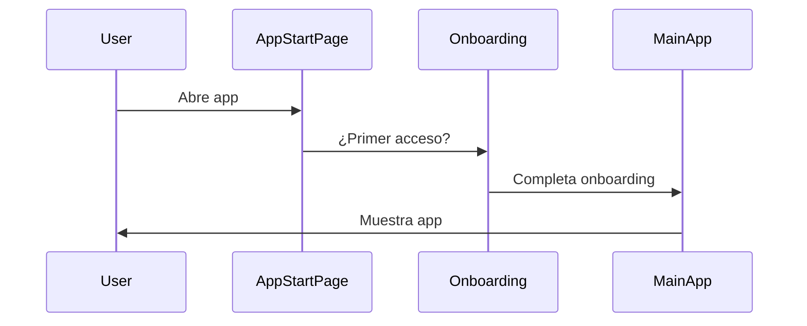
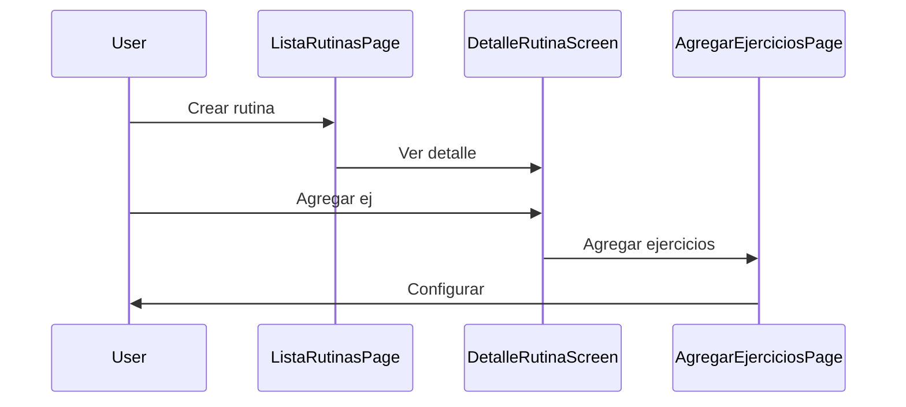
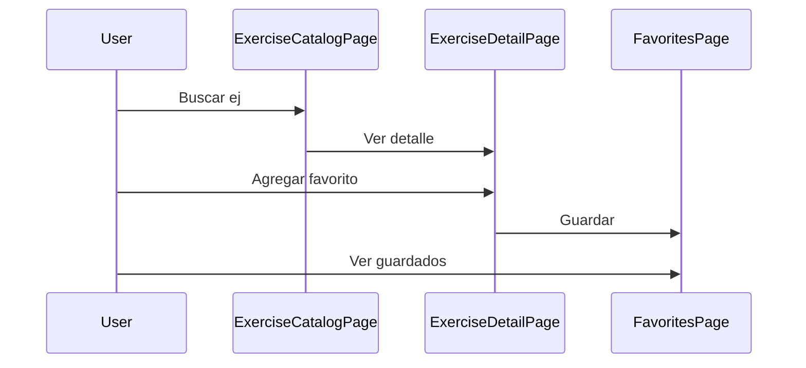

# 🎉 Análisis Completo de Navegación - GyMaster

## ✅ Documentación Generada

Se ha creado una **documentación completa y profesional** de la navegación de tu aplicación Flutter GyMaster con **6 documentos** y más de **2,100 líneas** de contenido, **20+ diagramas Mermaid** interactivos.

---

## 📊 Resumen de Documentos Generados

### 1. **INDICE_NAVEGACION.md** 📑

- Punto de entrada principal
- Índice de todos los documentos
- Guía sobre cuál leer según tus necesidades
- Links rápidos
- Resumen ejecutivo

### 2. **rutas_navegacion.md** 🗺️

- Documento base/principal
- Descripción general completa
- Diagrama de flujo general
- 5 módulos explicados
- Navegación por tabs
- Flujos completos de usuario

### 3. **mapa_navegacion_completo.md** 📋

- Análisis técnico detallado
- Tabla completa de 17 rutas
- Diagramas de secuencia
- Interconexiones de módulos
- Parámetros explicados
- Puntos críticos
- Flujo técnico completo

### 4. **diagrama_visual_navegacion.md** 🎨

- Visualización simplificada
- Vista general con subgrafos
- Ciclo de vida
- Transiciones entre módulos
- Matriz de navegación
- Estructura por módulo

### 5. **VISUALIZACION_COMPLETA.md** 🎯

- Diagrama arquitectónico integrado
- Flujos detallados por módulo
- Estado Management y Cubits
- Mapa de localización de archivos
- Relaciones entre módulos
- Diagrama más complejo y visual

### 6. **referencia_rapida_navegacion.md** ⚡

- Guía rápida de desarrollo
- Ejemplos de código en Dart
- Tabla de parámetros
- Cubits principales
- Errores comunes
- Validaciones
- Checklist para agregar rutas

---

## 📈 Estadísticas

| Métrica                 | Cantidad |
| ----------------------- | -------- |
| Documentos creados      | 6        |
| Líneas de documentación | 2,100+   |
| Diagramas Mermaid       | 25+      |
| Rutas documentadas      | 17       |
| Módulos                 | 5        |
| Cubits documentados     | 13       |
| Parámetros explicados   | 7+       |
| Ejemplos de código      | 20+      |

---

## 🎯 Estructura de Navegación Identificada

### ✅ Entrada y Onboarding

```
/ → /onboarding → /onboarding_unificado → /main
```

### ✅ Aplicación Principal (5 Tabs)

```
/main (BottomNavigationBarExampleApp)
├── Tab 0: Rutinas (/main?tab=0)
├── Tab 1: Favoritos (/main?tab=1)
├── Tab 2: Catálogo (/main?tab=2)
├── Tab 3: Historial (/main?tab=3)
└── Tab 4: Configuración (/main?tab=4)
```

### ✅ Módulo Rutinas (7 rutas)

```
ListaRutinasPage → AgregarRutinaPage
              → DetalleRutinaScreen → AgregarEjerciciosPage
                                  → ListarEjerciciosPage
                                  → AgregarEjercicioRutinaPage
                                  → DetalleEjercicioScreen
```

### ✅ Módulo Ejercicios (3 rutas)

```
ExerciseCatalogPage → ExerciseDetailPage → FavoritesPage
```

### ✅ Módulo Historial (2 rutas)

```
HistorialConEstadisticasPage → HistorialEjerciciosPage
```

### ✅ Módulo Configuración (1 ruta)

```
SettingPage (/settings o /main?tab=4)
```

---

## 🛠️ Tecnología Identificada

✅ **Router:** GoRouter
✅ **State Management:** BLoC/Cubit
✅ **Persistencia:** SQLite + SharedPreferences
✅ **Arquitectura:** Clean Architecture
✅ **Patrón:** Feature-based modular

---

## 📚 Cómo Usar la Documentación

### Para Nuevos Desarrolladores

1. **Comienza con:** `INDICE_NAVEGACION.md`
2. **Lee:** `rutas_navegacion.md`
3. **Visualiza:** `diagrama_visual_navegacion.md`
4. **Practica:** `referencia_rapida_navegacion.md`

### Para Desarrolladores Experimentados

1. **Referencia rápida:** `referencia_rapida_navegacion.md`
2. **Detalles técnicos:** `mapa_navegacion_completo.md`
3. **Arquitectura:** `VISUALIZACION_COMPLETA.md`

### Para Arquitectos/Líderes

1. **Visión general:** `VISUALIZACION_COMPLETA.md`
2. **Detalles:** `mapa_navegacion_completo.md`
3. **Contexto:** `rutas_navegacion.md`

---

## 🚀 Acciones Recomendadas

### ✅ Documentar en el Proyecto

```bash
✓ Todos los archivos ya están en: c:\projects\gymaster\doc\
✓ Listos para compartir con el equipo
✓ Formatos: Markdown con diagramas Mermaid
```

### ✅ Próximos Pasos

- [ ] Compartir documentación con el equipo
- [ ] Usar como referencia en code reviews
- [ ] Actualizar cuando agregues nuevas rutas
- [ ] Referencia durante onboarding de nuevos devs

### ✅ Mantenimiento

- Actualizar `referencia_rapida_navegacion.md` cuando agregues rutas
- Mantener sincronizado `mapa_navegacion_completo.md`
- Usar diagramas de `VISUALIZACION_COMPLETA.md` en documentación interna

---

## 🎓 Flujos Principales Documentados

### 1️⃣ Primer Acceso de Usuario



### 2️⃣ Crear y Ejecutar Rutina



### 3️⃣ Explorar Catálogo



---

## 📝 Información Técnica Extractada

### Rutas Identificadas (17 Total)

1. `/` - AppStartPage
2. `/onboarding` - OnboardingBienvenidaPage
3. `/onboarding_unificado` - OnboardingContenedorUnificadoPage
4. `/main` - BottomNavigationBarExampleApp
5. `/exercise-catalog` - Acceso directo a Tab 2
6. `/dialog-loading` - LoadingDialogPage
7. `/settings` - SettingPage
8. `/rutina/create` - AgregarRutinaPage
9. `/rutina/detalle/:rutinaId` - DetalleRutinaScreen
10. `/agregar-ejercicios/:rutinaId/:sesionId` - AgregarEjerciciosPage
11. `/listar-ejercicios/:musculoId:nombreMusculo:rutinaId:sesionId` - ListarEjerciciosPage
12. `/agregar-ejercicio-rutina/:rutinaId:ejercicioId:ejercicioNombre:sesionId` - AgregarEjercicioRutinaPage
13. `/detalle-ejercicio` - DetalleEjercicioScreen
14. `/lista-rutinas-screen` - ListaRutinasPage
15. `/exercise-detail` - ExerciseDetailPage
16. `/favorites` - FavoritesPage
17. `/record` - HistorialEjerciciosPage

### Cubits Principales (13 Total)

**Rutinas:** RoutineCubit, SeriesCubit, EjercicioCubit, AgregarSeriesCubit, EjerciciosByRutinaCubit, RealizacionEjercicioCubit, RealizarEjercicioRutinaCubit, MusculoCubit

**Ejercicios:** ExerciseCubit, FavoritoEjercicioCubit

**Configuración:** SettingCubit, AppStartCubit, OnboardingCubit

**Historial:** RecordCubit, SelectedRoutineCubit

---

## 🎨 Diagramas Creados

✅ Diagrama de flujo general
✅ Módulos principales
✅ Navegación por tabs
✅ Flujos completos (user journeys)
✅ Ciclo de vida de navegación
✅ Transiciones entre módulos
✅ Matriz de navegación
✅ Diagramas de secuencia
✅ Estado management
✅ Mapa de componentes
✅ Mapa de archivos
✅ Interconexiones
✅ Y muchos más...

---

## 💡 Insights Clave

1. **Arquitectura Modular Clara** - Separación limpia de 5 módulos principales
2. **GoRouter Bien Implementado** - Rutas nombradas y parámetros tipados
3. **State Management Organizado** - Cubits específicos por módulo
4. **Flujos de Usuario Claros** - Navegación predecible y lógica
5. **Escalable** - Estructura lista para crecer

---

## 📞 Notas para el Equipo

### ✅ Fortalezas Identificadas

- Arquitectura limpia y organizada
- Navegación bien estructurada
- Modulación clara de funcionalidades
- Nombres descriptivos en rutas

### 🎯 Oportunidades de Mejora

- Algunos parámetros de ruta son largos (considera usar extra data)
- Considerar named routes en constantes
- Documentar validaciones en rutas

---

## 📂 Ubicación de Archivos

Todos los documentos están en:

```
c:\projects\gymaster\doc\

├── INDICE_NAVEGACION.md              ← Comienza aquí
├── rutas_navegacion.md               ← Base teórica
├── mapa_navegacion_completo.md       ← Detalles técnicos
├── diagrama_visual_navegacion.md     ← Visualización
├── VISUALIZACION_COMPLETA.md         ← Arquitectura integrada
├── referencia_rapida_navegacion.md   ← Práctico/Desarrollo
└── README_ANALISIS.md                ← Este archivo
```

---

## 🎯 Próximas Recomendaciones

1. **Compartir** 📤 - Distribuir documentación entre el equipo
2. **Onboarding** 🎓 - Usar en inducción de nuevos devs
3. **Referencia** 📖 - Consultar en code reviews
4. **Mantener** 🔄 - Actualizar cuando cambie la navegación
5. **Expandir** 📈 - Agregar flujos de errores y edge cases

---

## ✨ Resumen

Se ha generado una **documentación profesional, completa y bien organizada** de la navegación de GyMaster con:

- 📚 **6 documentos complementarios**
- 📊 **25+ diagramas interactivos Mermaid**
- 📝 **2,100+ líneas de documentación detallada**
- 🎯 **17 rutas completamente documentadas**
- 💡 **Ejemplos de código en Dart**
- 🛠️ **Guías prácticas de desarrollo**
- 🎨 **Visualizaciones arquitectónicas**

**¡Lista para compartir con tu equipo! 🚀**

---

**Fecha:** 19 de octubre de 2025  
**Autor:** Análisis Automático  
**Estado:** ✅ COMPLETADO  
**Versión:** 1.0
