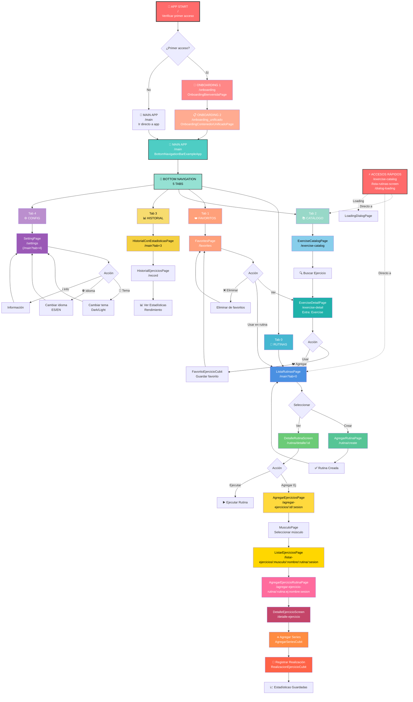
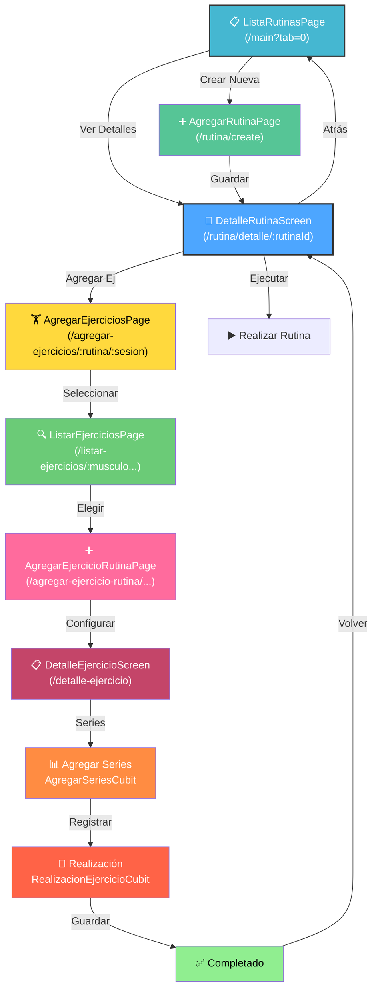
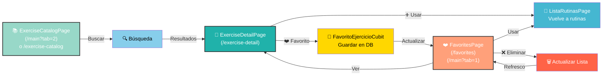
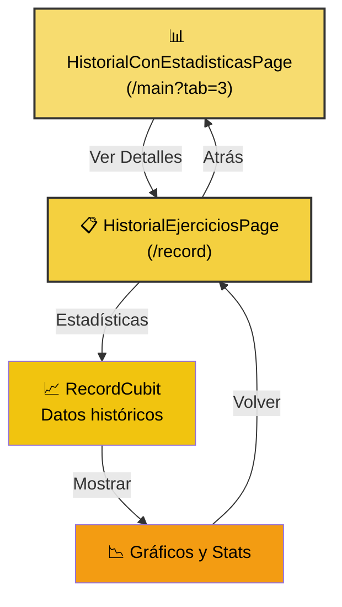
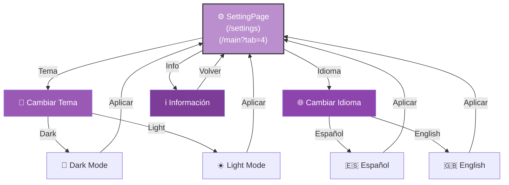
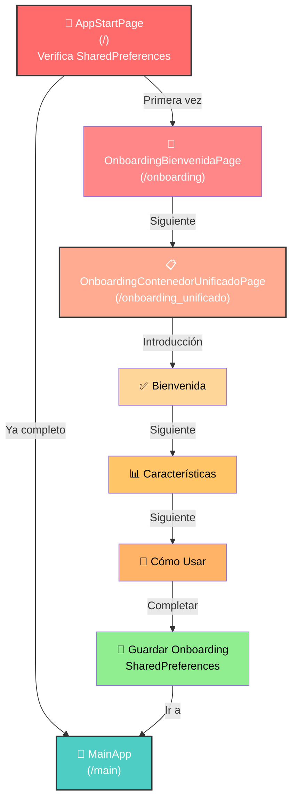
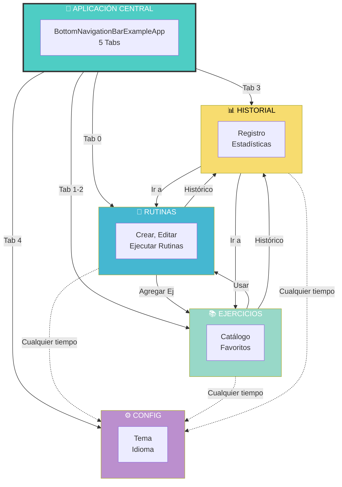
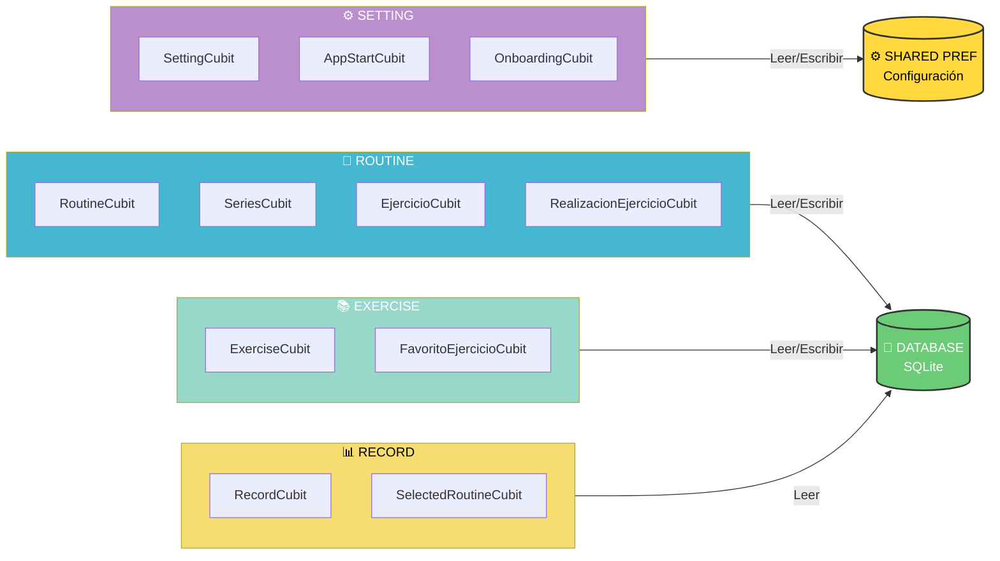

# 🎨 Visualización Interactiva del Flujo - GyMaster

## 🏗️ Arquitectura Completa de Navegación



---

## 🎯 Diagrama de Transiciones por Módulo

### 💪 Módulo RUTINAS (Flujo Detallado)



---

## 📚 Módulo EJERCICIOS (Flujo Detallado)



---

## 📊 Módulo HISTORIAL (Flujo Simple)



---

## ⚙️ Módulo CONFIGURACIÓN (Flujo)



---

## 🚀 Flujo de ONBOARDING



---

## 🔗 Relaciones Entre Módulos



---

## 🎮 Estado y Cubits (Estado Management)



---

## 📍 Mapa de Localización de Archivos

```
lib/
├── app_router.dart 🔴 ← Configuración GoRouter
│
├── features/
│   ├── setting/presentation/pages/
│   │   ├── app_start_page.dart 🚀
│   │   ├── onboarding_bienvenida_page.dart 👋
│   │   ├── onboarding_contenedor_unificado_page.dart 📋
│   │   └── setting_page.dart ⚙️
│   │
│   ├── routine/presentation/pages/
│   │   ├── lista_rutina_page.dart 💪
│   │   ├── agregar_rutina_page.dart ➕
│   │   ├── detalle_rutina_page.dart 📄
│   │   ├── agregar_ejercicios_page.dart 🏋️
│   │   ├── listar_ejercicios_page.dart 🔍
│   │   ├── detalle_ejercicio_page.dart 📋
│   │   └── agregar_ejercicios_rutina_page.dart ➕
│   │
│   ├── exercise/presentation/pages/
│   │   ├── exercise_catalog_page.dart 📚
│   │   ├── exercise_detail_page.dart 📖
│   │   └── favorites_page.dart ❤️
│   │
│   └── record/presentation/pages/
│       ├── historial_ejercicios_page.dart 📋
│       └── historial_con_estadisticas_page.dart 📊
│
└── shared/widgets/
    ├── barra_navegacion.dart 🔽
    └── loading_dialog_page.dart ⏳
```

---

**Última actualización:** 19 de octubre de 2025  
**Versión:** 1.0  
**Tipo:** Visualización Interactiva 🎨
