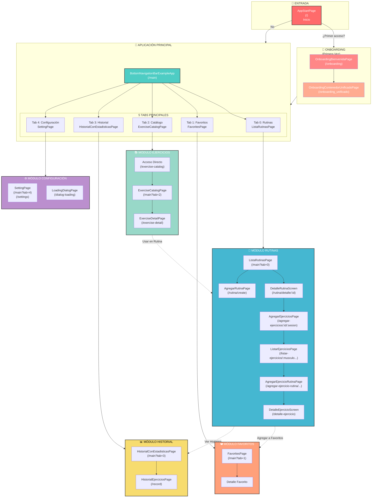
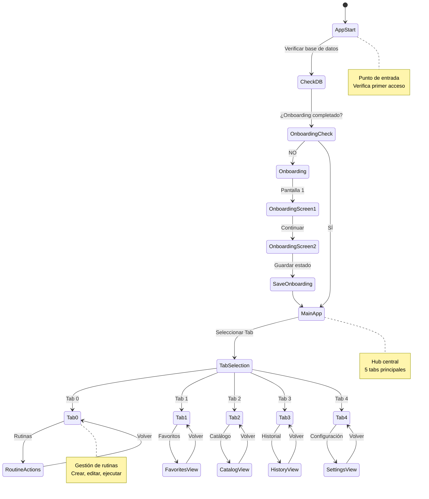
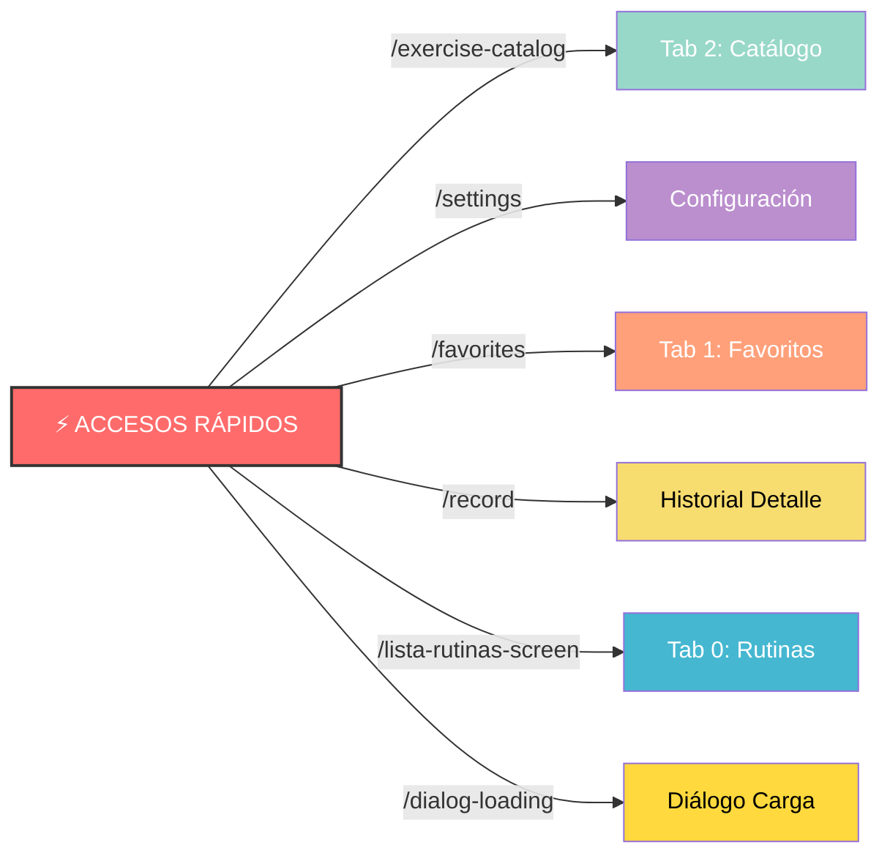
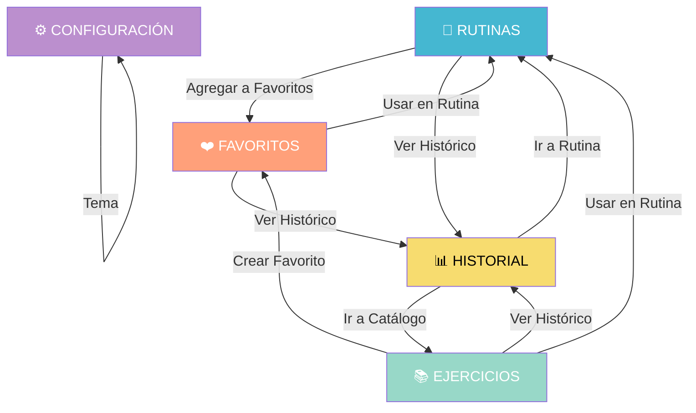
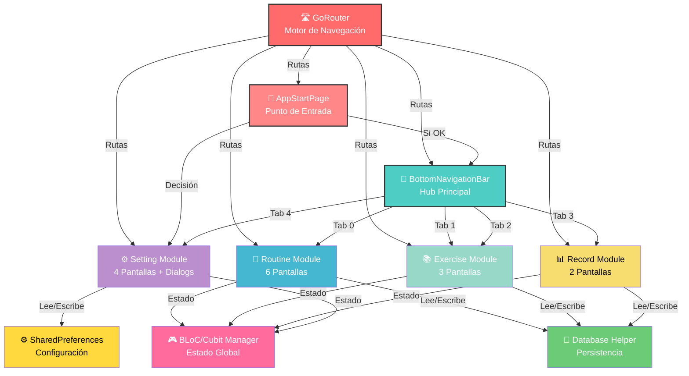

# 🎯 Diagrama Visual de Navegación - GyMaster

## 📊 Vista General Simplificada



---

## 🔄 Ciclo de Vida de la Navegación



---

## 🎯 Mapa de Acceso Rápido (Shortcuts)



---

## 📋 Estructura de Pantallas por Módulo

### 💪 MÓDULO RUTINAS

```
ListaRutinasPage (Principal)
├── ➕ Crear Rutina
│   └── AgregarRutinaPage
│       └── Vuelve a ListaRutinasPage
├── 👁️ Ver Detalle
│   └── DetalleRutinaScreen
│       ├── ➕ Agregar Ejercicio
│       │   └── AgregarEjerciciosPage
│       │       └── Seleccionar Músculo
│       │           └── ListarEjerciciosPage
│       │               └── Agregar Ejercicio
│       │                   └── AgregarEjercicioRutinaPage
│       │                       └── DetalleEjercicioScreen
│       └── ▶️ Ejecutar Rutina
│           └── Realizar Series
└── 🔄 Volver a ListaRutinasPage
```

### 📚 MÓDULO EJERCICIOS

```
ExerciseCatalogPage (Principal)
├── 🔍 Buscar Ejercicio
└── 📖 Ver Detalle
    └── ExerciseDetailPage
        ├── ❤️ Agregar a Favoritos
        │   └── FavoritesPage
        └── ➕ Agregar a Rutina
            └── ListaRutinasPage
```

### ❤️ MÓDULO FAVORITOS

```
FavoritesPage (Principal)
├── 📖 Ver Detalle
│   └── ExerciseDetailPage
├── ❌ Eliminar
│   └── Actualizar Lista
└── ➕ Usar en Rutina
    └── ListaRutinasPage
```

### 📊 MÓDULO HISTORIAL

```
HistorialConEstadisticasPage (Principal)
├── 📋 Ver Detalles
│   └── HistorialEjerciciosPage
└── 📈 Estadísticas
    └── Integradas en página
```

### ⚙️ MÓDULO CONFIGURACIÓN

```
SettingPage (Principal)
├── 🌙 Cambiar Tema
├── 🌐 Cambiar Idioma
├── 📊 Ver Estadísticas
└── 📋 Más opciones
```

---

## 🔀 Transiciones Entre Módulos



---

## 🧩 Diagrama de Componentes Principales



---

## 📍 Matriz de Navegación

| Desde                             | A                                 | Método                                          | Parámetros                                   |
| --------------------------------- | --------------------------------- | ----------------------------------------------- | -------------------------------------------- |
| AppStartPage                      | OnboardingBienvenidaPage          | context.go()                                    | -                                            |
| OnboardingBienvenidaPage          | OnboardingContenedorUnificadoPage | context.go()                                    | -                                            |
| OnboardingContenedorUnificadoPage | MainApp                           | context.go('/main')                             | -                                            |
| MainApp                           | ListaRutinasPage                  | setState                                        | tab=0                                        |
| ListaRutinasPage                  | AgregarRutinaPage                 | context.go('/rutina/create')                    | -                                            |
| ListaRutinasPage                  | DetalleRutinaScreen               | context.go('/rutina/detalle/:id')               | rutinaId                                     |
| DetalleRutinaScreen               | AgregarEjerciciosPage             | context.go('/agregar-ejercicios/:id/:sesion')   | rutinaId, sesionId                           |
| AgregarEjerciciosPage             | ListarEjerciciosPage              | context.go('/listar-ejercicios/...')            | musculoId, nombreMusculo, rutinaId, sesionId |
| ListarEjerciciosPage              | AgregarEjercicioRutinaPage        | context.go('/agregar-ejercicio-rutina/...')     | rutinaId, ejercicioId, etc                   |
| ExerciseCatalogPage               | ExerciseDetailPage                | context.go('/exercise-detail', extra: Exercise) | exercise                                     |
| ExerciseDetailPage                | FavoritesPage                     | FavoritoEjercicioCubit                          | -                                            |
| FavoritesPage                     | ExerciseDetailPage                | context.go('/exercise-detail', extra: Exercise) | exercise                                     |
| HistorialConEstadisticasPage      | HistorialEjerciciosPage           | context.go('/record')                           | -                                            |

---

**Última actualización:** 19 de octubre de 2025  
**Versión:** 1.0  
**Categoría:** Documentación Visual 📊
