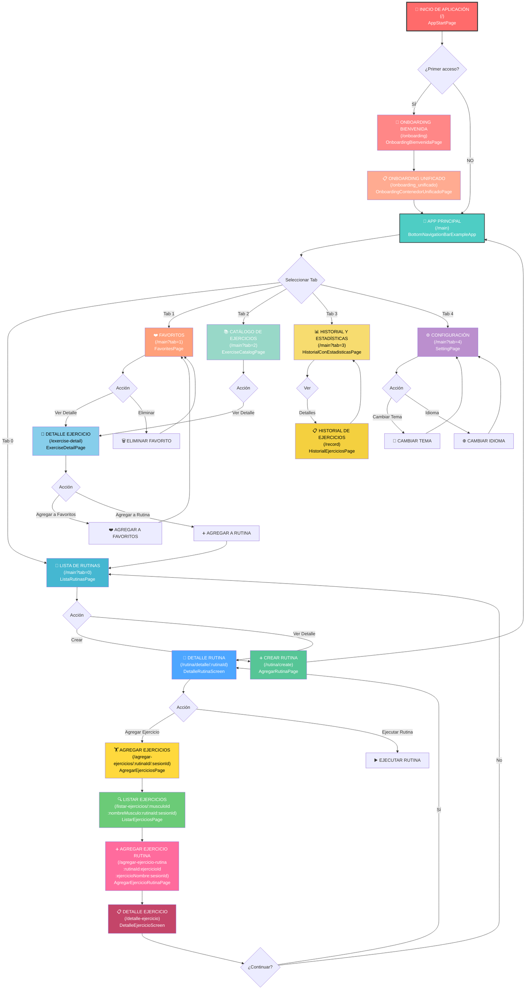
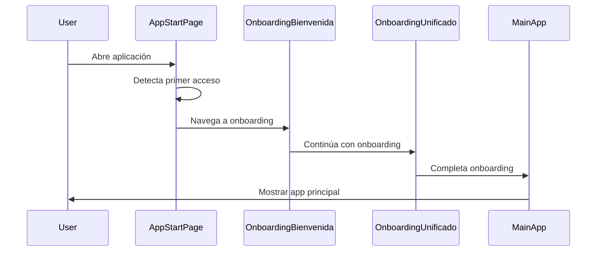
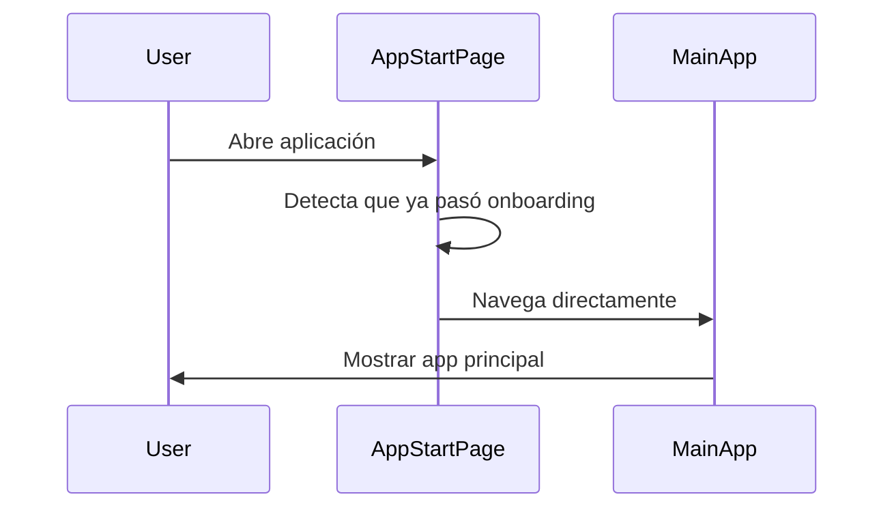
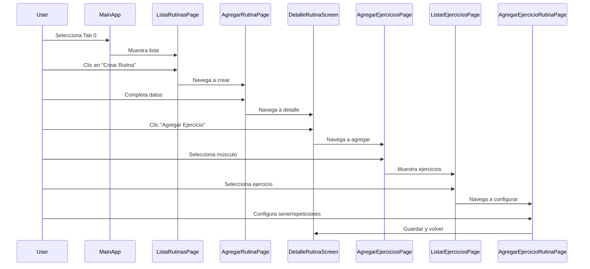
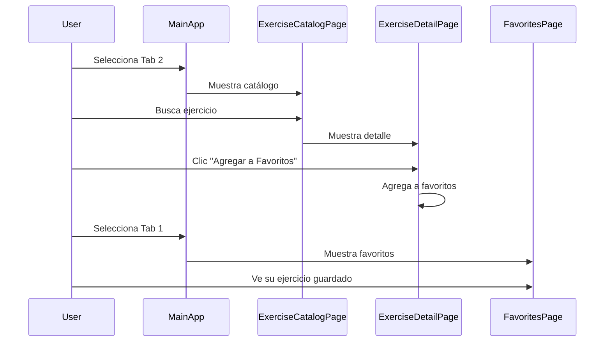
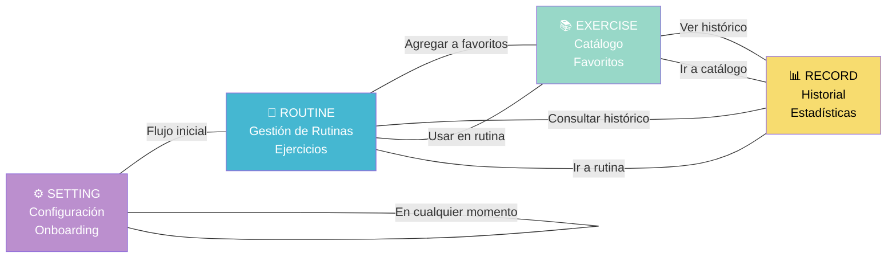
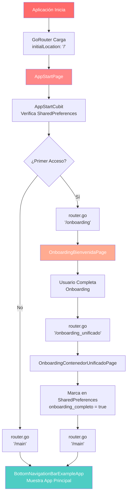

# 🗺️ Mapa Completo de Navegación - GyMaster (DETALLADO)

## 🎯 Diagrama Completo del Flujo de Navegación



---

## 📊 Tabla Completa de Rutas

| #   | Ruta                                                                          | Nombre                 | Página                            | Descripción                                       | Parámetros                                                                         |
| --- | ----------------------------------------------------------------------------- | ---------------------- | --------------------------------- | ------------------------------------------------- | ---------------------------------------------------------------------------------- |
| 1   | `/`                                                                           | appStart               | AppStartPage                      | Pantalla inicial que verifica si es primer acceso | -                                                                                  |
| 2   | `/onboarding`                                                                 | onboarding             | OnboardingBienvenidaPage          | Primera pantalla de bienvenida                    | -                                                                                  |
| 3   | `/onboarding_unificado`                                                       | onboarding_unificado   | OnboardingContenedorUnificadoPage | Onboarding completo unificado                     | -                                                                                  |
| 4   | `/main`                                                                       | listaRutinas           | BottomNavigationBarExampleApp     | Navegación principal con tabs                     | tab (0-4)                                                                          |
| 5   | `/exercise-catalog`                                                           | exerciseCatalog        | BottomNavigationBarExampleApp     | Acceso directo al catálogo (Tab 2)                | -                                                                                  |
| 6   | `/dialog-loading`                                                             | dialogLoading          | LoadingDialogPage                 | Diálogo de carga                                  | -                                                                                  |
| 7   | `/settings`                                                                   | settings               | SettingPage                       | Configuración de la aplicación                    | -                                                                                  |
| 8   | `/rutina/create`                                                              | rutinaCreate           | AgregarRutinaPage                 | Crear nueva rutina                                | -                                                                                  |
| 9   | `/rutina/detalle/:rutinaId`                                                   | detallerutina          | DetalleRutinaScreen               | Ver detalles de una rutina                        | rutinaId                                                                           |
| 10  | `/agregar-ejercicios/:rutinaId/:sesionId`                                     | agregarEjercicios      | AgregarEjerciciosPage             | Agregar ejercicios a rutina                       | rutinaId, sesionId                                                                 |
| 11  | `/listar-ejercicios/:musculoId/:nombreMusculo/:rutinaId/:sesionId`            | listarEjercicios       | ListarEjerciciosPage              | Listar ejercicios por músculo                     | musculoId, nombreMusculo, rutinaId, sesionId                                       |
| 12  | `/agregar-ejercicio-rutina/:rutinaId/:ejercicioId/:ejercicioNombre/:sesionId` | agregarEjercicioRutina | AgregarEjercicioRutinaPage        | Agregar ejercicio específico                      | rutinaId, ejercicioId, ejercicioNombre, sesionId + extra: ejercicioImagenDireccion |
| 13  | `/detalle-ejercicio`                                                          | detalleEjercicio       | DetalleEjercicioScreen            | Detalle del ejercicio en rutina                   | -                                                                                  |
| 14  | `/lista-rutinas-screen`                                                       | listaRutinasScreen     | ListaRutinasPage                  | Pantalla lista de rutinas                         | -                                                                                  |
| 15  | `/exercise-detail`                                                            | exerciseDetail         | ExerciseDetailPage                | Detalle del ejercicio en catálogo                 | extra: Exercise                                                                    |
| 16  | `/favorites`                                                                  | favorites              | FavoritesPage                     | Pantalla de favoritos                             | -                                                                                  |
| 17  | `/record`                                                                     | -                      | HistorialEjerciciosPage           | Historial de ejercicios                           | -                                                                                  |

---

## 🎯 Flujos de Navegación Principales

### Flujo 1: Primer Acceso (New User)



### Flujo 2: Usuario Habitual



### Flujo 3: Crear y Agregar Ejercicios a Rutina



### Flujo 4: Explorar Catálogo y Agregar Favoritos



---

## 🔄 Interconexiones de Módulos



---

## 🧭 Navegación por Parámetros

### Path Parameters

```
:rutinaId           → ID único de la rutina
:sesionId           → ID único de la sesión de ejercicios
:musculoId          → ID único del grupo muscular
:nombreMusculo      → Nombre descriptivo del músculo
:ejercicioId        → ID único del ejercicio
:ejercicioNombre    → Nombre descriptivo del ejercicio
```

### Query Parameters

```
tab=0 → ListaRutinasPage (Rutinas)
tab=1 → FavoritesPage (Favoritos)
tab=2 → ExerciseCatalogPage (Catálogo)
tab=3 → HistorialConEstadisticasPage (Historial)
tab=4 → SettingPage (Configuración)
```

### Extra Data

```
Exercise            → Objeto Exercise completo pasado en state.extra
ejercicioImagenDireccion → URL de la imagen del ejercicio en extra
```

---

## 📱 Estado Management y Navegación

### Cubits Principales

```mermaid
graph TD
    RoutineCubit["💪 RoutineCubit<br/>Gestionar rutinas"]
    SeriesCubit["📊 SeriesCubit<br/>Gestionar series"]
    MusculoCubit["🔍 MusculoCubit<br/>Listar músculos"]
    EjercicioCubit["🏋️ EjercicioCubit<br/>Listar ejercicios"]

    AgregarSeriesCubit["➕ AgregarSeriesCubit<br/>Agregar series"]
    EjerciciosByRutinaCubit["📋 EjerciciosByRutinaCubit<br/>Ejercicios por rutina"]
    RealizacionCubit["📝 RealizacionEjercicioCubit<br/>Registrar realización"]
    RealizarRutinaCubit["▶️ RealizarEjercicioRutinaCubit<br/>Ejecutar rutina"]

    SettingCubit["⚙️ SettingCubit<br/>Tema/Idioma"]
    AppStartCubit["🚀 AppStartCubit<br/>Control de onboarding"]
    OnboardingCubit["👋 OnboardingCubit<br/>Onboarding"]

    RecordCubit["📊 RecordCubit<br/>Historial"]
    SelectedRoutineCubit["✓ SelectedRoutineCubit<br/>Rutina seleccionada"]

    ExerciseCubit["📚 ExerciseCubit<br/>Catálogo"]
    FavoritosCubit["❤️ FavoritoEjercicioCubit<br/>Favoritos"]

    style RoutineCubit fill:#45B7D1,color:#fff
    style SeriesCubit fill:#4DA6FF,color:#fff
    style MusculoCubit fill:#6BCB77,color:#fff
    style EjercicioCubit fill:#FFD93D,color:#000

    style AgregarSeriesCubit fill:#FF6B9D,color:#fff
    style EjerciciosByRutinaCubit fill:#C44569,color:#fff
    style RealizacionCubit fill:#9B4D4D,color:#fff
    style RealizarRutinaCubit fill:#FF8C42,color:#fff

    style SettingCubit fill:#BB8FCE,color:#fff
    style AppStartCubit fill:#FF6B6B,color:#fff
    style OnboardingCubit fill:#FF8787,color:#fff

    style RecordCubit fill:#F7DC6F,color:#000
    style SelectedRoutineCubit fill:#F4D03F,color:#000

    style ExerciseCubit fill:#98D8C8,color:#fff
    style FavoritosCubit fill:#FFA07A,color:#fff
```



---

## ⚠️ Puntos Críticos de Navegación

1. **AppStartPage** - Punto de entrada que determina el flujo (onboarding o main)
2. **BottomNavigationBarExampleApp** - Hub central de navegación con 5 tabs
3. **DetalleRutinaScreen** - Punto de acceso para agregar ejercicios
4. **ListarEjerciciosPage** - Filtrado de ejercicios por músculo
5. **ExerciseDetailPage** - Bridge entre catálogo y favoritos/rutinas

---

## 📌 Casos de Uso Especiales

### 1. Navegar Directamente al Catálogo

```
Ruta: /exercise-catalog
Resultado: Muestra BottomNavigationBarExampleApp con Tab 2 activo
```

### 2. Pasar Ejercicio a DetalleEjercicio

```
Ruta: /exercise-detail
Parámetro: state.extra = Exercise (objeto)
Resultado: Muestra detalle del ejercicio con opciones
```

### 3. Cargar Diálogo de Carga

```
Ruta: /dialog-loading
Resultado: Muestra pantalla de carga
```

### 4. Navegar a Tab Específico

```
Ruta: /main?tab=2
Resultado: Abre la app en el Tab 2 (Catálogo)
```

---

## 🚀 Flujo Técnico de Inicio de Sesión



---

**Última actualización:** 19 de octubre de 2025  
**Versión:** 2.0  
**Estado:** Análisis Completo ✅
