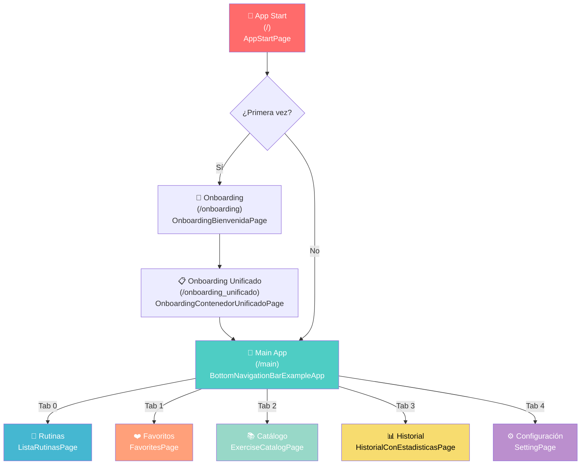
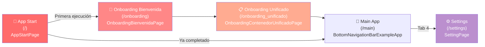
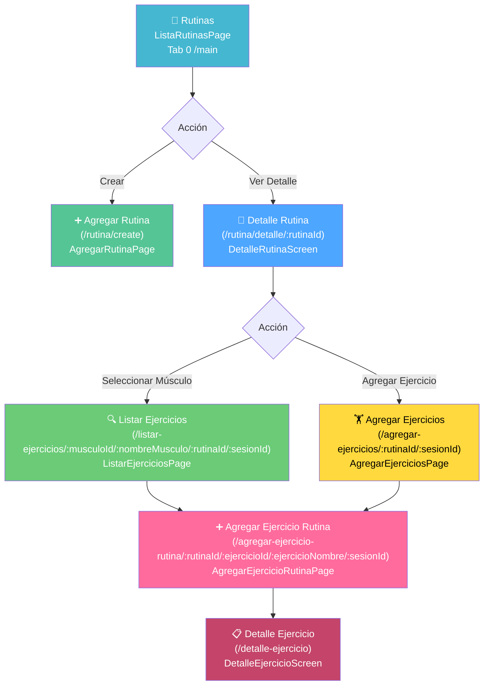
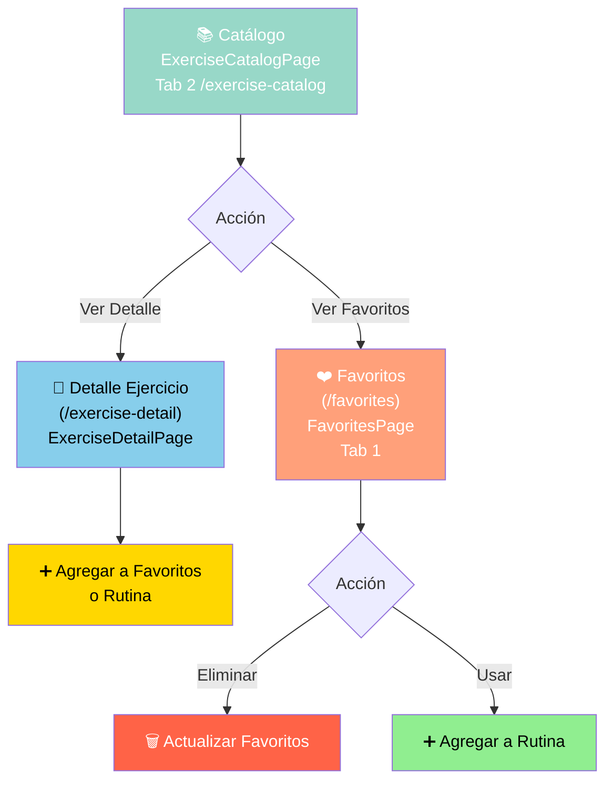
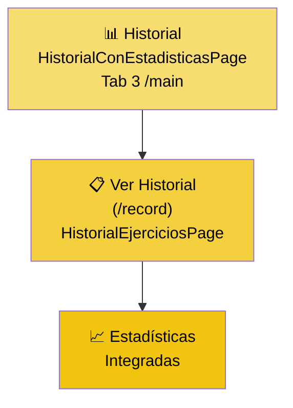
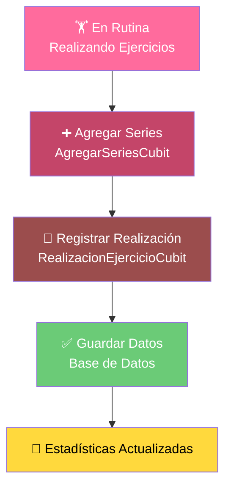

# 🗺️ Mapa de Navegación - GyMaster

## Descripción General

Este documento describe la estructura completa de navegación de la aplicación GyMaster, una aplicación Flutter de gestión de rutinas de ejercicios. La navegación se gestiona mediante **GoRouter** y está organizada en 5 módulos principales.

---

## 📊 Diagrama de Flujo General



---

## 📱 Módulos Principales

### 1. **SETTING (Configuración y Onboarding)**



**Rutas:**

- `/` → `AppStartPage` - Pantalla de inicio (verifica si necesita onboarding)
- `/onboarding` → `OnboardingBienvenidaPage` - Primera pantalla de bienvenida
- `/onboarding_unificado` → `OnboardingContenedorUnificadoPage` - Onboarding completo unificado
- `/settings` → `SettingPage` - Configuración de la aplicación

---

### 2. **ROUTINE (Gestión de Rutinas)**



**Rutas:**

- `/main` (Tab 0) → `ListaRutinasPage` - Lista de rutinas
- `/rutina/create` → `AgregarRutinaPage` - Crear nueva rutina
- `/rutina/detalle/:rutinaId` → `DetalleRutinaScreen` - Detalle de rutina
- `/agregar-ejercicios/:rutinaId/:sesionId` → `AgregarEjerciciosPage` - Agregar ejercicios
- `/listar-ejercicios/:musculoId/:nombreMusculo/:rutinaId/:sesionId` → `ListarEjerciciosPage` - Listar ejercicios por músculo
- `/agregar-ejercicio-rutina/:rutinaId/:ejercicioId/:ejercicioNombre/:sesionId` → `AgregarEjercicioRutinaPage` - Agregar ejercicio a rutina
- `/detalle-ejercicio` → `DetalleEjercicioScreen` - Detalle del ejercicio

**Parámetros:**

- `rutinaId` - ID de la rutina
- `sesionId` - ID de la sesión
- `musculoId` - ID del músculo
- `nombreMusculo` - Nombre del músculo
- `ejercicioId` - ID del ejercicio
- `ejercicioNombre` - Nombre del ejercicio
- `ejercicioImagenDireccion` - URL de la imagen (en extra)

---

### 3. **EXERCISE (Catálogo y Favoritos)**



**Rutas:**

- `/main` (Tab 2) → `ExerciseCatalogPage` - Catálogo de ejercicios
- `/exercise-catalog` → `BottomNavigationBarExampleApp(initialIndex: 2)` - Acceso directo al catálogo
- `/exercise-detail` → `ExerciseDetailPage` - Detalle del ejercicio (requiere `Exercise` en `extra`)
- `/favorites` → `FavoritesPage` - Pantalla de favoritos
- `/main` (Tab 1) → `FavoritesPage` - Acceso desde navegación principal

**Parámetros:**

- `exercise` - Objeto Exercise pasado en `state.extra`

---

### 4. **RECORD (Historial y Estadísticas)**



**Rutas:**

- `/main` (Tab 3) → `HistorialConEstadisticasPage` - Historial con estadísticas
- `/record` → `HistorialEjerciciosPage` - Historial de ejercicios

---

### 5. **EJERCICIOS (Realización de Ejercicios)**



**Cubits relacionados:**

- `RealizacionEjercicioCubit` - Gestiona la realización de ejercicios
- `RealizarEjercicioRutinaCubit` - Ejecutar ejercicio en rutina
- `AgregarSeriesCubit` - Agregar series de ejercicios
- `EjerciciosByRutinaCubit` - Obtener ejercicios por rutina

---

## 🎯 Navegación por Tabs (Bottom Navigation)

La navegación principal utiliza un `BottomNavigationBar` con 5 tabs accesibles desde `/main`:

| Tab | Ruta          | Página                         | Descripción              |
| --- | ------------- | ------------------------------ | ------------------------ |
| 0   | `/main?tab=0` | `ListaRutinasPage`             | Gestión de rutinas       |
| 1   | `/main?tab=1` | `FavoritesPage`                | Ejercicios favoritos     |
| 2   | `/main?tab=2` | `ExerciseCatalogPage`          | Catálogo completo        |
| 3   | `/main?tab=3` | `HistorialConEstadisticasPage` | Historial y estadísticas |
| 4   | `/main?tab=4` | `SettingPage`                  | Configuración            |

**Acceso rápido:**

- `/exercise-catalog` redirige a Tab 2

---

## 📋 Flujo Completo de Usuario

### Primer Acceso (Nuevo Usuario)

```
/ (AppStartPage)
  ↓
/onboarding (OnboardingBienvenidaPage)
  ↓
/onboarding_unificado (OnboardingContenedorUnificadoPage)
  ↓
/main (BottomNavigationBarExampleApp)
```

### Usuario Habitual

```
/ (AppStartPage)
  ↓
/main (BottomNavigationBarExampleApp) - Tab seleccionado
```

### Crear y Ejecutar Rutina

```
/main (Tab 0 - ListaRutinasPage)
  ↓
/rutina/create (AgregarRutinaPage)
  ↓
/rutina/detalle/:rutinaId (DetalleRutinaScreen)
  ↓
/agregar-ejercicios/:rutinaId/:sesionId (AgregarEjerciciosPage)
  ↓
/listar-ejercicios/:musculoId/:nombreMusculo/:rutinaId/:sesionId (ListarEjerciciosPage)
  ↓
/agregar-ejercicio-rutina/:rutinaId/:ejercicioId/:ejercicioNombre/:sesionId (AgregarEjercicioRutinaPage)
  ↓
/detalle-ejercicio (DetalleEjercicioScreen)
```

### Explorar y Agregar Favoritos

```
/main (Tab 2 - ExerciseCatalogPage)
  ↓
/exercise-detail (ExerciseDetailPage)
  ↓
❤️ Agregar a Favoritos (FavoritoEjercicioCubit)
  ↓
/favorites (FavoritesPage) - Ver en favoritos
```

---

## 🔧 Configuración Técnica

### Router Configuration

- **Tipo:** GoRouter
- **Ubicación inicial:** `/`
- **Total de rutas:** 14+ (sin contar variaciones con parámetros)

### State Management

- **BLoC Pattern** con Cubits
- **Múltiples Cubits** para diferentes módulos

### Parámetros de Ruta

- **Path Parameters:** `:rutinaId`, `:sesionId`, `:musculoId`, `:nombreMusculo`, `:ejercicioId`, `:ejercicioNombre`
- **Query Parameters:** `tab` (para seleccionar tab inicial)
- **Extra Data:** Objetos complejos como `Exercise`

---

## 📌 Notas Importantes

1. **Rutas con múltiples parámetros** - Algunas rutas tienen parámetros largos para mantener el contexto completo sin depender de servicios.

2. **Dialog Loading** - Existe una ruta especial `/dialog-loading` para mostrar diálogos de carga.

3. **List Routines Screen** - Ruta adicional `/lista-rutinas-screen` que accede a `ListaRutinasPage`.

4. **Navegación a Tabs** - Se puede navegar directamente a un tab específico usando `/main?tab=X`.

5. **Extra Data** - Para datos complejos como objetos `Exercise`, se utiliza el parámetro `extra` de GoRouter.

---

## 🎨 Leyenda de Colores

- 🔴 **Rojo** - Puntos de inicio
- 🔵 **Azul** - Gestión de rutinas
- 🟢 **Verde** - Gestos de ejercicios
- 🟡 **Amarillo** - Historial/Estadísticas
- 🟣 **Violeta** - Configuración
- 🔴 **Rosa** - Detalles y acciones

---

## 📖 Estructura de Código

```
lib/
├── app_router.dart          ← Configuración principal de GoRouter
├── core/
│   ├── routes/
│   │   └── routes.dart      ← Constantes de rutas (no utilizadas en GoRouter)
│   └── ...
├── features/
│   ├── setting/presentation/pages/
│   │   ├── app_start_page.dart
│   │   ├── onboarding_bienvenida_page.dart
│   │   ├── onboarding_contenedor_unificado_page.dart
│   │   └── setting_page.dart
│   ├── routine/presentation/pages/
│   │   ├── lista_rutina_page.dart
│   │   ├── agregar_rutina_page.dart
│   │   ├── detalle_rutina_page.dart
│   │   ├── agregar_ejercicios_page.dart
│   │   ├── listar_ejercicios_page.dart
│   │   ├── detalle_ejercicio_page.dart
│   │   └── agregar_ejercicios_rutina_page.dart
│   ├── exercise/presentation/pages/
│   │   ├── exercise_catalog_page.dart
│   │   ├── exercise_detail_page.dart
│   │   └── favorites_page.dart
│   ├── record/presentation/pages/
│   │   ├── historial_ejercicios_page.dart
│   │   └── historial_con_estadisticas_page.dart
│   └── ...
└── shared/widgets/
    ├── barra_navegacion.dart
    └── loading_dialog_page.dart
```

---

---

## 📚 Documentos Relacionados

Este análisis completo está dividido en varios documentos para mejor organización:

1. **rutas_navegacion.md** (Este archivo) - Documento principal con descripción general
2. **mapa_navegacion_completo.md** - Análisis detallado con diagramas Mermaid complejos
3. **diagrama_visual_navegacion.md** - Visualización simplificada y matriz de navegación

---

## 🎓 Cómo Usar Este Documento

- 📖 **Lectura Rápida:** Ve a la sección "Diagrama de Flujo General"
- 🔍 **Buscar Ruta Específica:** Consulta la "Tabla Completa de Rutas" en `mapa_navegacion_completo.md`
- 📊 **Ver Flujos:** Revisa los diagramas Mermaid en cualquier sección
- 🛠️ **Implementar:** Lee la "Estructura de Código" para entender dónde modificar

---

**Última actualización:** 19 de octubre de 2025
**Versión:** 1.0
**Análisis Completado:** ✅ Documento maestro + 2 documentos complementarios
